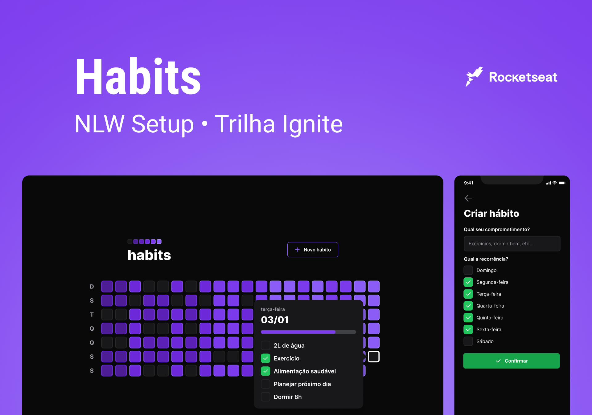
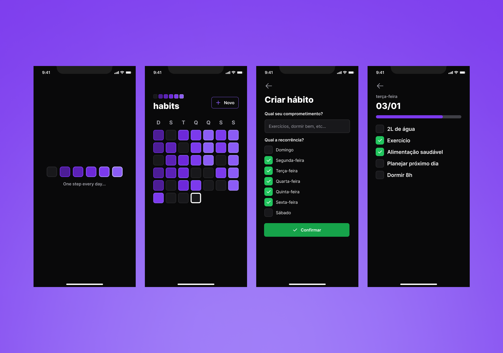
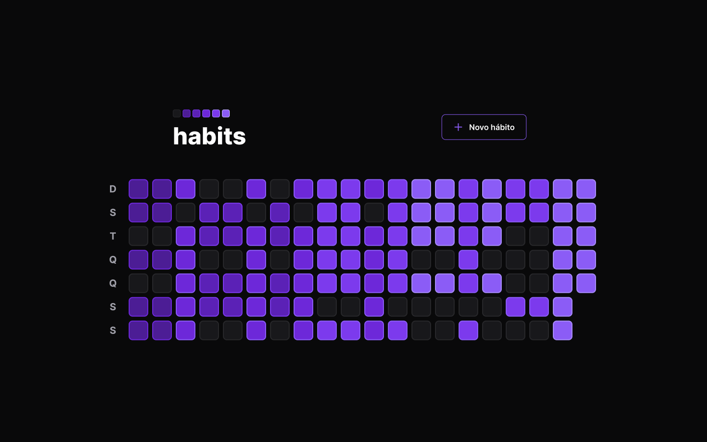
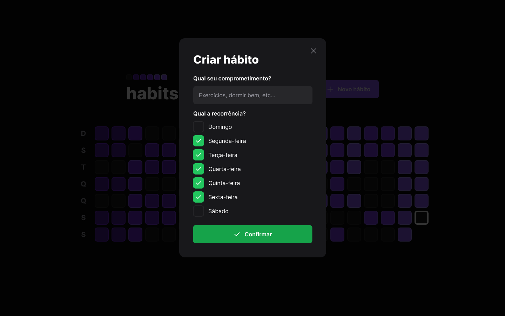
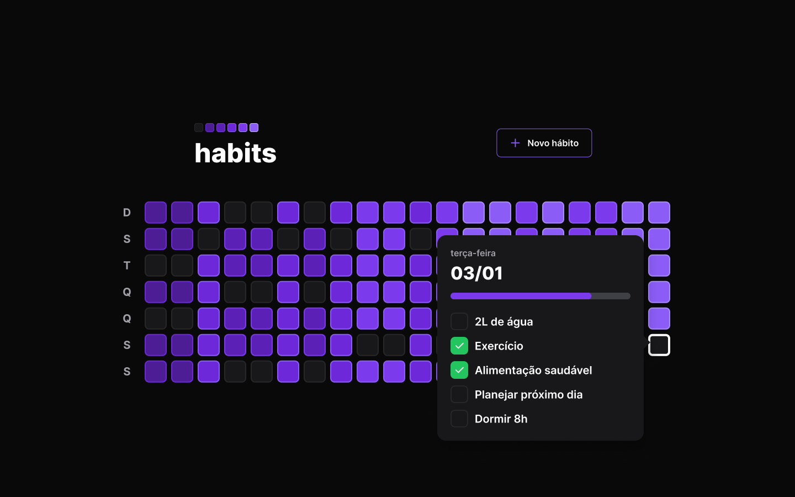

# NLW SETUP - Habits 

O Habits é um aplicativo de controle de hábitos desenvolvido durante a NLW Setup. Ele ajuda os usuários a colocar em prática suas resoluções e metas, permitindo que eles registrem suas ações e acompanhem a evolução dos novos hábitos que desejam incluir em sua rotina. Construimos uma aplicação de ponta a ponta, desde a [API Restful](https://github.com/ruan4f/nlw-setup-ignite/tree/master/server) até as versões [Web](https://github.com/ruan4f/nlw-setup-ignite/tree/master/web) e [Mobile](https://github.com/ruan4f/nlw-setup-ignite/tree/master/mobile), utilizamos as tecnologias ReactJS, React Native, Expo, NodeJS, Fastify, Tailwind, NativeWind, Typescript e Javascript.

# Demonstração
Aqui você pode conferir um pouco do design do Habit, para conferir o projeto no Figma, [clique aqui](https://www.figma.com/community/file/1195326661124171197).

## Mobile - Screens

## Web - Home

## Web - New Habit

## Web - Habit Example

## 💡 Como contribuir

- Faça um **_fork_** desse repositório;
- Crie um **branch** para a sua feature: `git checkout -b minha-feature`;
- Faça um **commit** com suas alterações: `git commit -m 'feat: Minha nova feature'`;
- Faça um **push** para o seu branch: `git push origin minha-feature`;
- Faça um **pull request** com sua feature;

Pull requests são sempre bem-vindos. Em caso de dúvidas ou sugestões, crie uma _**issue**_ ou entre em contato comigo.

## 📲 Contato

Entre em contato comigo por e-mail ou pelo meu LinkedIn:

## 📝 Licença

Esse projeto está sob a licença **MIT**. Veja o arquivo _**LICENSE**_ para mais detalhes.

---

<h5 align="center">
  &copy;2023 - <a href="https://github.com/ruan4f/">Ruan Ferreira</a>
</h5>